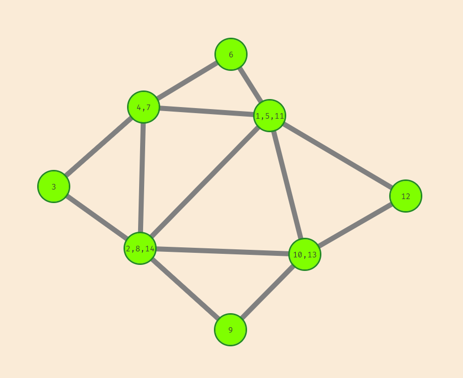

# Try the [demo hosted at github pages](https://zyxwars.github.io/eulerian-path-finder/)




## Run

Clone the repo

```
git clone https://github.com/zyxwars/eulerian-path-finder.git
```

Then run

```
npm start
```
